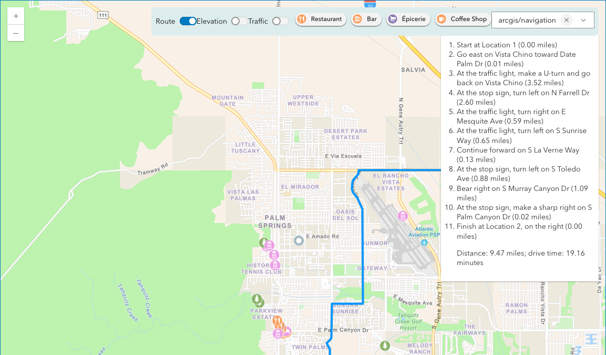

# ArcGIS Location Platform: An introduction for developers

ArcGIS Location Platform is a geospatial (PaaS) for developers to integrate location capabilities into their apps and business systems.

This demo app uses [ArcGIS Location Platform](https://location.arcgis.com) and [ArcGIS Maps SDK for JavaScript](https://developers.arcgis.com/javascript/latest/) in order to demonstrate the following features:

* Basemap select: choose from navigation, imagery, or your own custom basemap.
* Data hosting with feature service: import a CSV with curated Palm Springs tourist attractions. Style each point with unique value renderer and popup template.
* Route and directions between two selected points.
* Show/hide traffic layer from the Living Atlas of the World.
* Show elevation at point
* Use the Places service to query for near by places of specific categories.

To run this demo:

1. You need an [ArcGIS Location Platform](https://location.arcgis.com) account. If you do not have one, [sign up for free](https://location.arcgis.com/sign-up/).
2. Log in to your account and create a new [feature service](https://location.arcgis.com/layers/) by importing `locations-palm-springs.csv`. See [Import data to create a feature layer](https://developers.arcgis.com/documentation/portal-and-data-services/data-services/tutorials/tools/import-data-to-create-a-feature-layer/) for step by step instructions.
3. Create your own custom basemap style. Follow the instructions at [Custom basemap styles](https://developers.arcgis.com/documentation/mapping-and-location-services/mapping/custom-basemap-styles/). Once you have your item ID, update the code `const customBasemapItemId = "...";` to your item ID. You may also update the image `custom-map.png` to represent a thumbnail of your custom style.
4. Create a new API key by going to [Developer credentials](https://location.arcgis.com/credentials/) and then click Create developer credentials. Select API key. Then add the following scopes:
  - [ ] Basemap styles service
  - [ ] Static basemap tiles
  - [ ] Places service
  - [ ] Geocode (not stored)
  - [ ] Routing: Simple routing
  - [ ] Elevation service

Include item access to the two items created in steps 2 and 3: the feature service and the custom basemap style must be scoped with your API key or you will not be able to render them in the demo app.

When you generate the API key copy it to clipboard.

5. Edit the file `secret-template.js` to replace `"YOUR_API_KEY"` with the API key you copied in the prior step. Save this file as `secret.js`. NOTE: `secret.js` is ignored from version control with `.gitignore`.
6. Load `index.html` in a web browser. You must run this with http/https, it will not run properly from `file://`. There are many options to running a local web server such as `python3 -m http.server` or the Live Server VS Code plugin or others.
